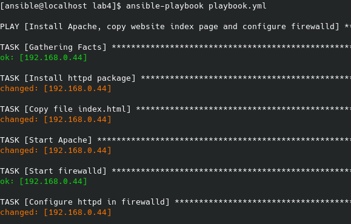
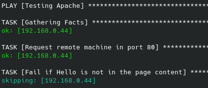
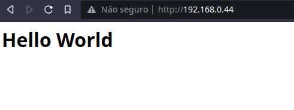
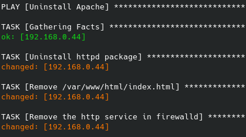

# Automating the configuration of an Apache server with Ansible

## The Ansible playbook for this project is divided into 3 plays

* The tasks in the first play install and start apache on the managed node, copy to it the index file used for the website and start and configure firewalld to allow http connections.

  

* The second play tests if the page provided by Apache is available. If not, something went wrong and the playbook is interrupted.

  

  

* The third play uninstalls Apache, removes the website index file and configures firewalld to refuse http connections again.

  

